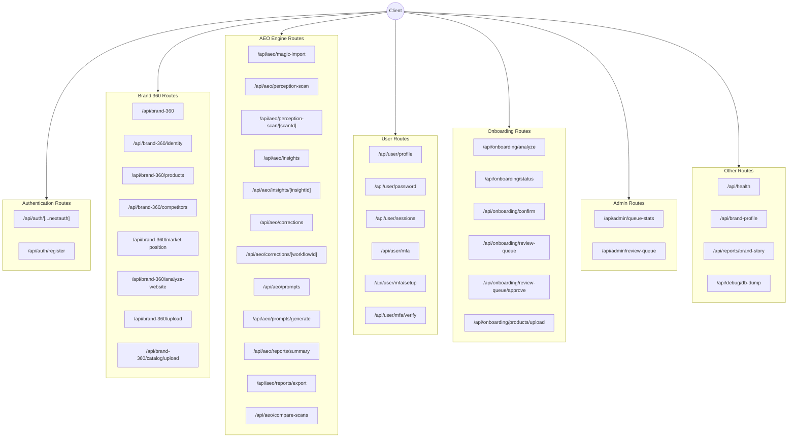
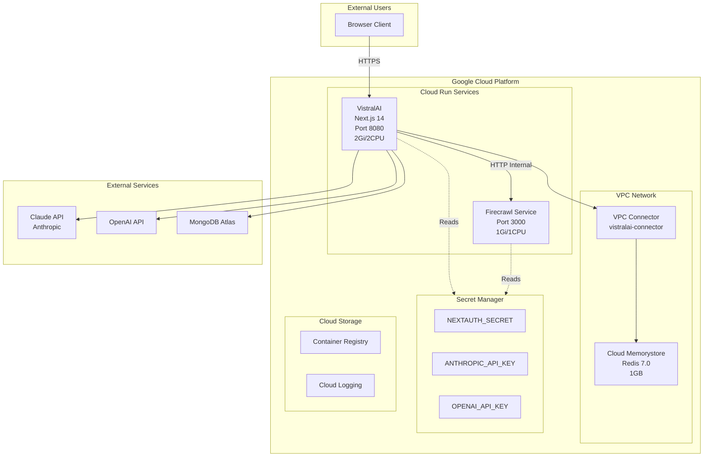
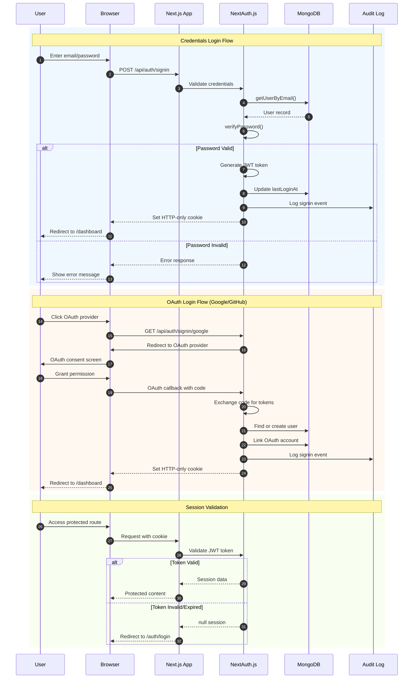
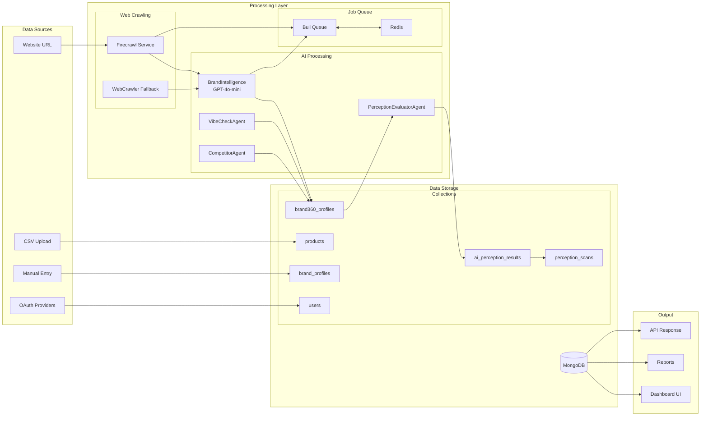
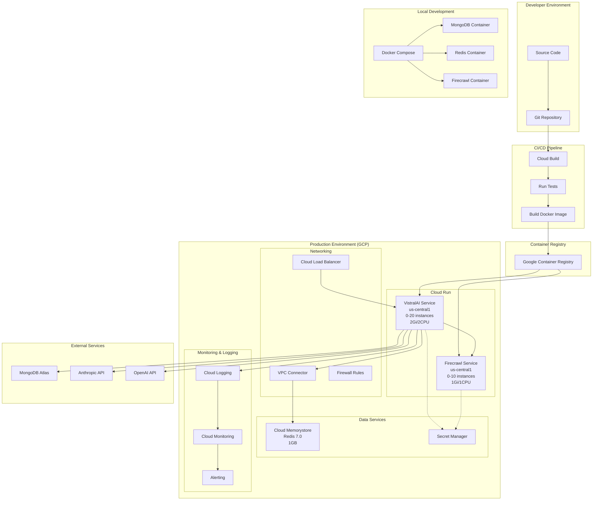
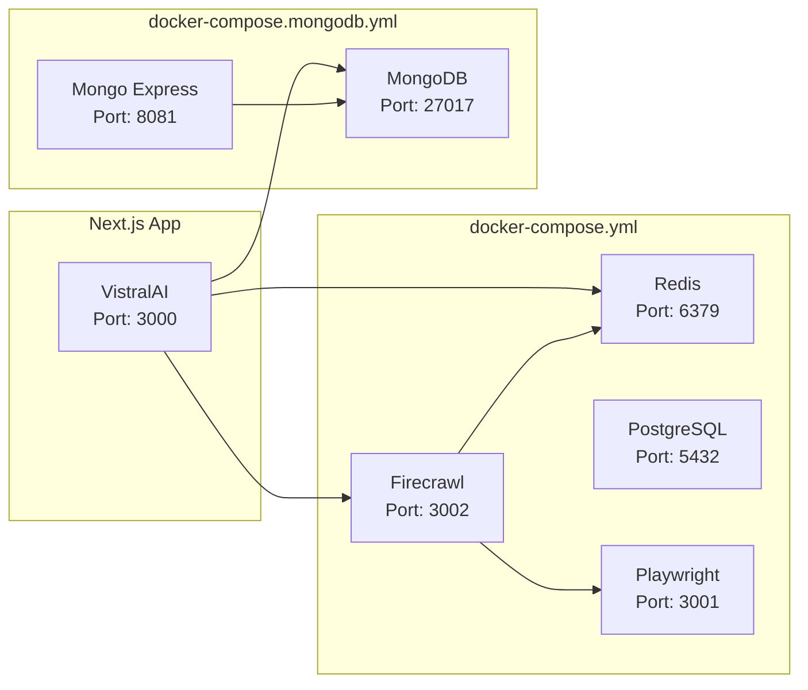
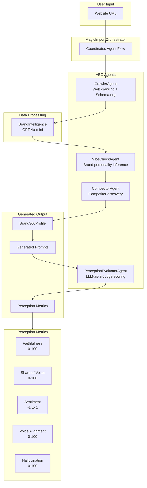
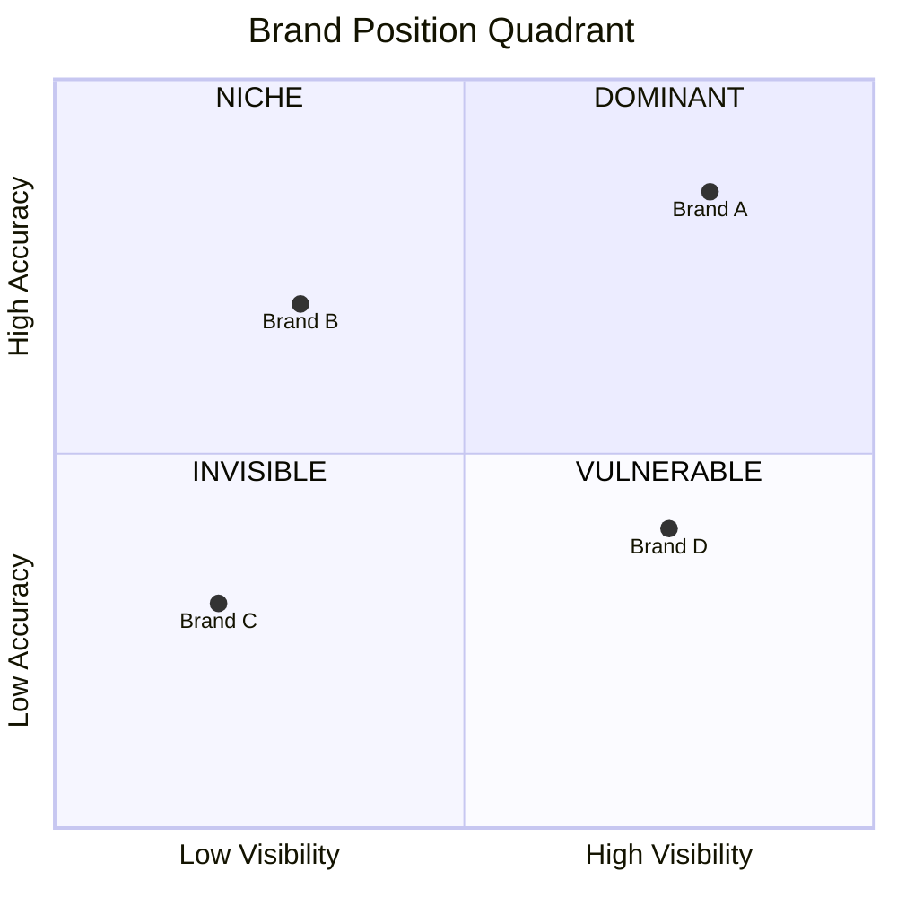

# VistralAI System Diagrams

All diagrams below are in Mermaid format. You can use them with:
- **Claude**: Paste the mermaid code block directly in a Claude conversation
- **Mermaid.live**: Copy code to [mermaid.live](https://mermaid.live) for editing/export
- **GitHub/GitLab**: Renders automatically in markdown files

---

## 1. API Route Diagram

---

## 2. Architecture Diagram

---

## 3. Auth Flow Diagram

---

## 4. Component Hierarchy Diagram

```mermaid
flowchart TB
    subgraph App["App Router"]
        Layout["RootLayout"]

        subgraph AuthPages["Auth Pages"]
            Login["LoginPage"]
            Register["RegisterPage"]
            Error["ErrorPage"]
        end

        subgraph Dashboard["Dashboard Pages"]
            DashLayout["DashboardLayout"]
            DashHome["DashboardPage"]
            Brand360Page["Brand360Page"]
            AEOPage["AEOPage"]
            ScanPage["ScanPage"]
            InsightsPage["InsightsPage"]
            SettingsPage["SettingsPage"]
            ReviewQueue["ReviewQueuePage"]
            ReportPage["ReportPage"]
        end

        Onboarding["OnboardingPage"]
    end

    subgraph Components["Shared Components"]
        subgraph LayoutComps["Layout"]
            DashboardLayoutComp["DashboardLayout"]
            SessionProvider["SessionProvider"]
        end

        subgraph AuthComps["Auth"]
            AuthForm["AuthForm"]
        end

        subgraph Brand360Comps["Brand 360"]
            WebsiteAnalyzer["WebsiteAnalyzer"]
            BrandStoryCanvas["BrandStoryCanvas"]
            BrandOfferingsShowcase["BrandOfferingsShowcase"]
            ProfileStrengthMeter["ProfileStrengthMeter"]
            DocumentUpload["DocumentUpload"]
            ProductCatalogConnector["ProductCatalogConnector"]
        end

        subgraph AEOComps["AEO Engine"]
            QuadrantChart["QuadrantChart"]
            MetricsRadarChart["MetricsRadarChart"]
            PerceptionScoreCard["PerceptionScoreCard"]
            PlatformComparisonChart["PlatformComparisonChart"]
            ScoreTrendChart["ScoreTrendChart"]
            InsightsPriorityMatrix["InsightsPriorityMatrix"]
            CorrectionFunnel["CorrectionFunnel"]
        end

        subgraph DashboardComps["Dashboard"]
            BrandPresenceHero["BrandPresenceHero"]
            BrandHealthIndicator["BrandHealthIndicator"]
            BrandMoments["BrandMoments"]
            BrandGrowthOpportunities["BrandGrowthOpportunities"]
            MarketLandscape["MarketLandscape"]
            BrandStoryVisualizer["BrandStoryVisualizer"]
            AIPlatformGalaxy["AIPlatformGalaxy"]
        end

        subgraph OnboardingComps["Onboarding"]
            OnboardingWizard["OnboardingWizard"]
            NewOnboardingWizard["NewOnboardingWizard"]
            UrlAnalyzer["UrlAnalyzer"]
            ProfileReviewCards["ProfileReviewCards"]
            ProductIngestionTabs["ProductIngestionTabs"]
        end

        subgraph UIComps["UI Components"]
            ThemeToggle["ThemeToggle"]
            ThemeSelector["ThemeSelector"]
            MetricCard["MetricCard"]
            AlertBanner["AlertBanner"]
            OpportunityCard["OpportunityCard"]
        end

        subgraph ReviewComps["Review Queue"]
            ReviewQueueBanner["ReviewQueueBanner"]
            ReviewModal["ReviewModal"]
            FieldReviewCard["FieldReviewCard"]
        end
    end

    Layout --> AuthPages
    Layout --> Dashboard
    Layout --> Onboarding
    DashLayout --> DashboardComps
    DashLayout --> LayoutComps
    Login --> AuthComps
    Register --> AuthComps
    Brand360Page --> Brand360Comps
    AEOPage --> AEOComps
    DashHome --> DashboardComps
    Onboarding --> OnboardingComps
    ReviewQueue --> ReviewComps
```

---

## 5. Data Flow Diagram

---

## 6. Database Schema Diagram (ERD)

```mermaid
erDiagram
    User ||--o| BrandProfile : has
    User ||--o{ Session : has
    User ||--o{ Membership : has
    Organization ||--o{ Membership : has

    BrandProfile ||--o| BrandIdentity : has
    BrandProfile ||--o| MarketPosition : has
    BrandProfile ||--o{ CompetitorProfile : has
    BrandProfile ||--o{ ProductDetail : has
    BrandProfile ||--o{ BrandAsset : has
    BrandProfile ||--o{ UploadedDocument : has

    Brand360Profile ||--o| EntityHome : has
    Brand360Profile ||--o| OrganizationSchema : has
    Brand360Profile ||--o| BrandIdentityPrism : has
    Brand360Profile ||--o| BrandArchetype : has
    Brand360Profile ||--o| BrandVoiceProfile : has
    Brand360Profile ||--o| ClaimLocker : has
    Brand360Profile ||--o| CompetitorGraph : has
    Brand360Profile ||--o| RiskFactors : has
    Brand360Profile ||--o{ CustomerPersona : has
    Brand360Profile ||--o{ Product : has
    Brand360Profile ||--o{ GeneratedPrompt : has
    Brand360Profile ||--o{ PerceptionScan : has
    Brand360Profile ||--o{ AIPerceptionResult : has
    Brand360Profile ||--o{ PerceptionInsight : has
    Brand360Profile ||--o{ CorrectionWorkflow : has

    ClaimLocker ||--o{ Claim : contains
    CompetitorGraph ||--o{ Competitor : contains
    PerceptionScan ||--o{ AIPerceptionResult : has
    GeneratedPrompt ||--o{ AIPerceptionResult : has
    PerceptionInsight ||--o| CorrectionWorkflow : creates

    User {
        string id PK
        string email UK
        string password
        string accountType
        string subscription
        boolean mfaEnabled
        datetime createdAt
    }

    BrandProfile {
        string id PK
        string userId FK
        string brandName
        string domain
        string category
        string crawlingStatus
    }

    Brand360Profile {
        string id PK
        string organizationId FK
        string brandName
        int completionScore
        int entityHealthScore
        datetime lastAnalyzedAt
    }

    BrandIdentity {
        string id PK
        string brandId FK
        string mission
        string vision
        string[] values
        string brandStory
    }

    PerceptionScan {
        string id PK
        string brand360Id FK
        string status
        string[] platforms
        float overallScore
        string quadrantPosition
    }

    AIPerceptionResult {
        string id PK
        string promptId FK
        string brand360Id FK
        string platform
        string response
        float faithfulnessScore
        float shareOfVoice
        float hallucinationScore
    }

    GeneratedPrompt {
        string id PK
        string brand360Id FK
        string category
        string intent
        string template
        string renderedPrompt
    }
```

---

## 7. Infrastructure and Deployment Diagram

---

## Docker Services Diagram

---

## AEO Agent Flow Diagram

---

## Quadrant Position Logic

---

## Usage Instructions

### Using with Claude
1. Copy the entire mermaid code block (including the triple backticks)
2. Paste directly into Claude conversation
3. Ask Claude to "render this diagram" or "show this diagram"
4. Claude will display the rendered diagram

### Using with Mermaid.live
1. Copy the code between the triple backticks (without the backticks)
2. Go to [mermaid.live](https://mermaid.live)
3. Paste in the editor - diagram renders automatically
4. Export as PNG, SVG, or share via link

### Using in Documentation
- GitHub/GitLab automatically render mermaid blocks in markdown
- VS Code with Mermaid extension previews diagrams
- Notion, Confluence support mermaid via plugins

---

**Last Updated**: December 2024
**Version**: 1.0
